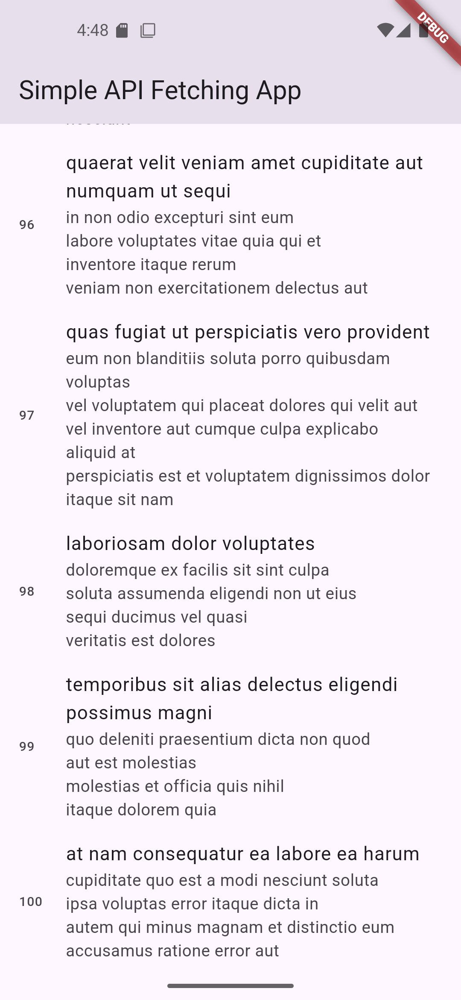

# Simple API Fetching App

A Flutter application that fetches posts from the JSONPlaceholder API and displays them in a scrollable list.

## Features

- Fetches data from the JSONPlaceholder API: `https://jsonplaceholder.typicode.com/posts`
- Displays the fetched data in a scrollable `ListView`
- Implements a loading indicator while fetching data
- Handles API errors gracefully by displaying an error message in case of a failure

## Getting Started

### Prerequisites

- Flutter SDK installed on your machine
- An IDE (e.g., Android Studio, Visual Studio Code) with Flutter and Dart plugins

### Screenshot

